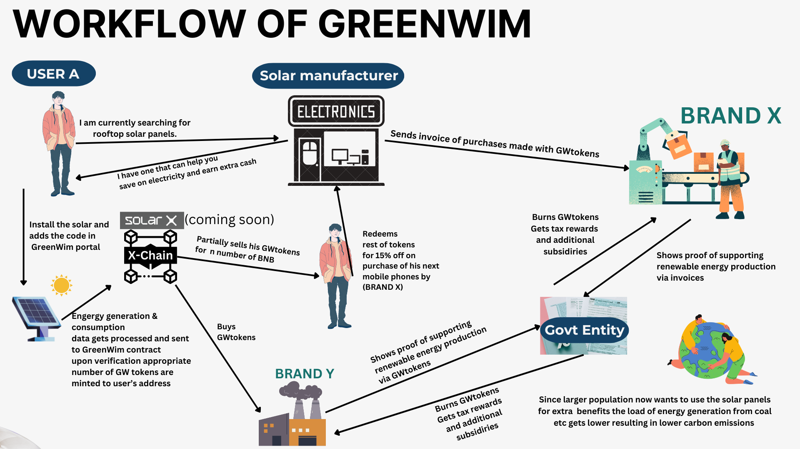

# GreenWim ( DePin extension to the solarX ecosystem )

GreenWim is an extension to the solarX ecosystem to promote the adoption and production of green energy through innovative financial incentives enabled by our GenSensor technology. This technology enables individuals to connect our smart sensors to their green energy sources, such as solar panels, to monitor and convert energy production into SLR points. These SLR points can then be exchanged for SXCH (after the mainnet launch; currently, they can be converted to ETH). SXCH allows users to participate in the broader green energy ecosystem. By establishing a transparent and economically viable marketplace for green energy, GreenWim not only encourages renewable energy generation but also reduces the global carbon footprint. Our platform offers financial incentives for clean energy usage, making it more accessible and financially appealing. This initiative empowers individuals to actively engage in a green energy future,  fostering a community committed to environmental stewardship.

# What it does ?
- **Aggregates Incentives:** GreenWim acts as an aggregator, offering a platform that consolidates incentives for stakeholders switching to renewable energy.

- **Provides Clear Information:** It provides clear information on financial rebates, tax credits, and other local incentives available for renewable energy systems. 

- **Unlocks Additional Incentives:** Offers extra direct or indirect financial incentives through the use of GreenWim sensors. 

- **Empowers Informed Choices:**  Empowers individuals to make informed decisions about adopting renewable energy systems. 

- **Reduces Upfront Costs:** Helps significantly reduce the upfront costs associated with renewable energy systems, making them more accessible.

- **Advances Energy Revolution:** Facilitates progress toward an energy revolution by ensuring incentives for all stakeholders.

# Workflow

# decentralized weather API Integration
- We are first fetching all the devices, then with the help of latitude and longitude, finding the nearest one. Then, we're fetching weather data from that particular local weather station. We are particularly interested in solar irradiance to help us calculate the valid maximum energy that could be generated by a solar panel. Based on that, we judge if our local sensors are tampered with to get an unfair number of tokens. We also reward users that submit their sensor's data along with nearby decentralized weather API device's data.

# Key Features

- **Alignment with Environmental and Social Outcomes:** Promotes renewable energy generation, which directly contributes to reducing the global carbon footprint, thereby supporting ecological sustainability.
  
- **Use of Blockchain and Transparency:**  The use of GenSensor technology to track energy production and convert it into digital tokens ensures transparency and traceability in energy generation and trading.
  
- **Tokenization and Marketplace Integration:** Converts energy production into digital tokens and facilitates the creation and trade of green energy certificates, enhancing market activity and efficiency.
  
- **Community Participation and Inclusivity:** Provides economic incentives for clean energy usage by making green energy financially attractive and accessible, encouraging wider adoption.

- **Economic Incentives for Sustainability:** Democratizes energy generation and consumption, creating a community of producers and consumers dedicated to promoting environmental sustainability.

- **Innovative Financial Instruments:** The use of digital tokens and green energy certificates represents innovative financial tools designed to support and accelerate renewable energy projects.

## Ecological Benefits

- Promotion of `Renewable Energy Generation`
- Economic Viability and `Incentives`
- Creation and Trade of `Renewable Energy Certificates`
- Reduction of `Carbon Footprint`
- Fostering Environmental `Governance`

GreenWim's innovative ecosystem, utilizing GenSensor technology and digital tokens, significantly advances renewable energy generation while creating a transparent and economically viable marketplace for green energy. This approach drives substantial ecological benefits and aligns with global sustainability and environmental protection goals. By incentivizing clean energy production through digital tokens, GreenWim promotes widespread adoption, reducing fossil fuel dependence and greenhouse gas emissions. Blockchain-enabled transparency enhances trust and accountability, ensuring a reliable market for green energy certificates. These efforts position GreenWim as a leader in the clean energy revolution, contributing meaningfully to global carbon reduction and ecological sustainability.

# Arduino Setup
1. Download `Arduino Modules` .
2. Add `INA219 Sensor` for collecting data .
3. Serialize the connection to get data .
4. Tokens will be generated after Collecting Data .

## Getting Started

To get started with GreenWim, follow these steps:

1. Clone the repository: `git clone https://github.com/akashbiswas0/ReFi-Hack`
2. Install dependencies: `npm install` then `npm run dev` for testing.
3. Configure your GenSensor devices (optional) and connect them to the GreenWim platform.
4. Start tracking and converting renewable energy production into digital tokens.
5. Explore the Green Energy Token Marketplace and participate in trading activities.

